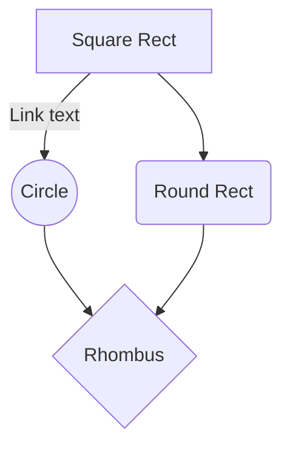

# Create a Mermaid Diagram with GitHub Copilot

This demo will walk you through creating a Mermaid diagram using GitHub Copilot. This is useful for customers who want to create diagrams quickly and easily using the power of Copilot suggestions and Mermaid syntax. 

## Prerequisites

- GitHub Copilot and GitHub Copilot Chat extension installed in your Visual Studio Code or IntelliJ IDEA
- Mermaid extension installed in your Visual Studio Code or IntelliJ IDEA

## Goal 

Create a Mermaid diagram that shows the relationship between different components in a system. 

Here is an example of a Mermaid diagram:



## Programming Language

- Markdown

## Guide

This with guide you through learning and creating a Mermaid diagram using GitHub Copilot.

### Step 1: Learn more about Mermaid Diagrams

In GitHub Copilot Chat, type the following prompt to learn more about Mermaid diagrams:

```
can you show me the different types of mermaid diagrams. Please make them car themed.
```

Bonus: ask Copilot to format the document in a way that is easy to read.

### Step 2: Create a Mermaid Diagram

Once you have chosen the type of Mermaid diagram you want to create, you can start writing the code.

For example, if you want to create a flowchart, you can use the following prompt: 

```

```
