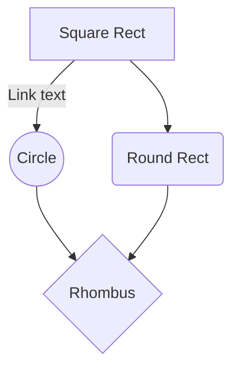

# Create a Mermaid Diagram with GitHub Copilot

This demo will walk you through creating a Mermaid diagram using GitHub Copilot. This is useful for customers who want to create diagrams quickly and easily using the power of Copilot suggestions and Mermaid syntax. 

## Prerequisites

- GitHub Copilot and GitHub Copilot Chat extension installed in your Visual Studio Code or IntelliJ IDEA
- Mermaid extension installed in your Visual Studio Code or IntelliJ IDEA

## Goal 

Create a Mermaid diagram that shows the relationship between different components in a system. 

Here is an example of a Mermaid diagram:



## Programming Language

- Markdown

## Guide

This with guide you through learning and creating a Mermaid diagram using GitHub Copilot.

### Step 1: Learn more about Mermaid Diagrams

In GitHub Copilot Chat, type the following prompt to learn more about Mermaid diagrams:

```
can you show me the different types of mermaid diagrams. Please make them car themed.
```

Bonus: ask Copilot to format the document in a way that is easy to read.

### Step 2: Create a Diagram

Once you have chosen the type of Mermaid diagram you want to create, you can start writing the code. 

#### Creating a gitGraph

For example, if you want to create a gitGraph, you can use the following prompts:

```
Help me create a new mermaid diagram gitGraph based on the criteria I send you in the upcoming prompts. 
Please let me know how I can improve my prompt as I type in the criteria 
```

Prompt 2 would be the criteria for the gitGraph diagram.

```
In the upcoming sprint, we will have two feature branches "add login" and "create login button". 
We will also have a bugfix branch "fix user mapping". 
These branches will merge into main one week after each other and start at the same time.
```

Prompt 3 would update the commits gitGraph diagram.

```
Can we add in commit ids to the gitGraph diagram to show the dates? 
Example: 'commit id: "May 30th"'. 
it should follow that pattern for the other commits.
```

#### Creating an Sequence Diagram

If you want to create an sequence diagram, you can use the following prompts:

Starting a new diagram

```
lets create a new sequence diagram
```

Telling Copilot how you want the prompts to be sent back to you.

```
when I type in my criteria, let me know how I can improve on my prompt.
```

Sending the criteria for the architecture diagram

```
The user will login to the front-end site. It will go to the authentication service which will verify the users email and password.
```

Adding a database.

```
How to show a database into my application for user profile management?
```

Error Handling.

```
can you show error handling in this sequence diagram? I want it to show an error if the user profile does not come back
```

Copilot Collaboration

```
Any use cases that could be added to this?
```
