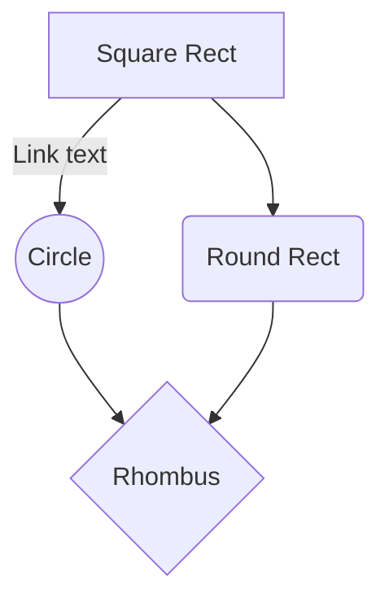

# Create a Mermaid Diagram with GitHub Copilot

This demo will walk you through creating a Mermaid diagram using GitHub Copilot. This is useful for customers who want to create diagrams quickly and easily using the power of Copilot suggestions and Mermaid syntax. 

## What is Mermaid?
Mermaid is a diagramming and charting tool that uses Markdown-inspired text definitions and a renderer to create and modify complex diagrams. 

## Prerequisites

- GitHub Copilot and GitHub Copilot Chat extension installed in your Visual Studio Code or IntelliJ IDEA
- [*Optional*] [Mermaid extension](https://marketplace.visualstudio.com/items?itemName=bierner.markdown-mermaid) installed in your Visual Studio Code or IntelliJ IDEA

## Goal 

Create a Mermaid diagram that shows the relationship between different system components. 

Here is an example of a Mermaid diagram:
> **_NOTE:_**  This will render as a diagram when viewed on github.com or using the optional Mermaid extension.



## Programming Language

- Markdown

## Guide

This with guide you through learning and creating a Mermaid diagram using GitHub Copilot.

## Step 1: Learn more about Mermaid Diagrams

In GitHub Copilot Chat, type the following prompt to learn more about Mermaid diagrams:

```
Show me the different types of mermaid diagrams. Use a car theme to help explain the different types.
```

> **_Bonus:_** prompt Copilot to format the document in a way that is easy to read.

## Step 2: Create a Diagram

Once you have chosen the type of Mermaid diagram you want to create, you can begin to write the Markdown code. 

### Creating a classDiagram

Lets explore creating a classDiagram.

*Prompt 1*
```
Help me create a new classDiagram based on the criteria I send you in the upcoming prompts. 
Please let me know how I can improve my prompt as I type in the criteria.
```

*Prompt 2* -
add the criteria for the classDiagram.

```
classDiagram
    class User {
        -String username
        -String password
        +login()
        +logout()
    }
    class Admin {
        -String adminID
        +manageUsers()
    }
    class Post {
    }
    User <|-- Admin : Inheritance
    User "1" -- "0..*" Post : posts
    Admin "1" -- "0..*" User : manages
```

*Prompt 3* - Add properties to the Post class 

```
Add some typical properties to the Post class.
```

## Conclusion

GitHub Copilot can be used to generate diagrams via the Markdown programming language!