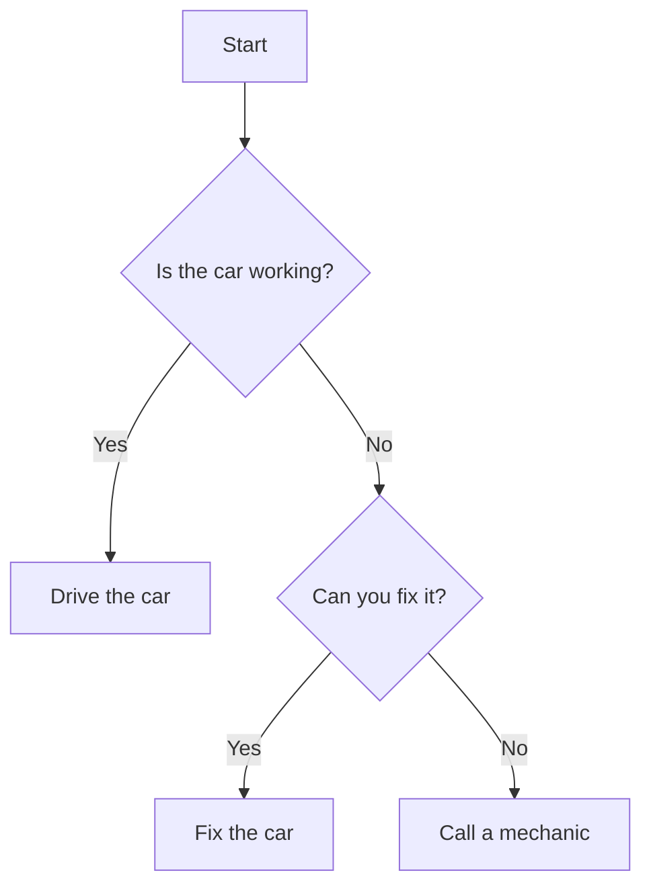
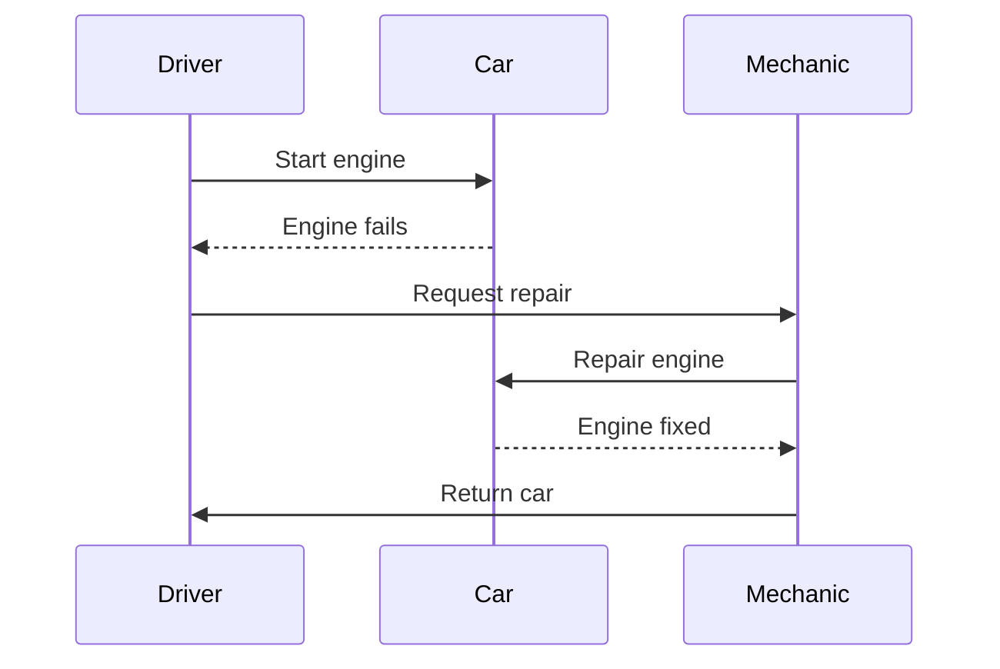
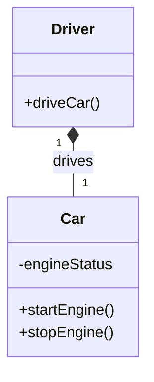
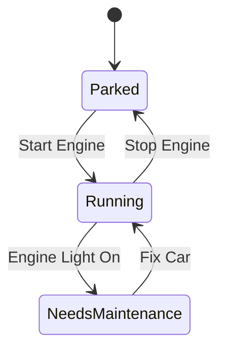
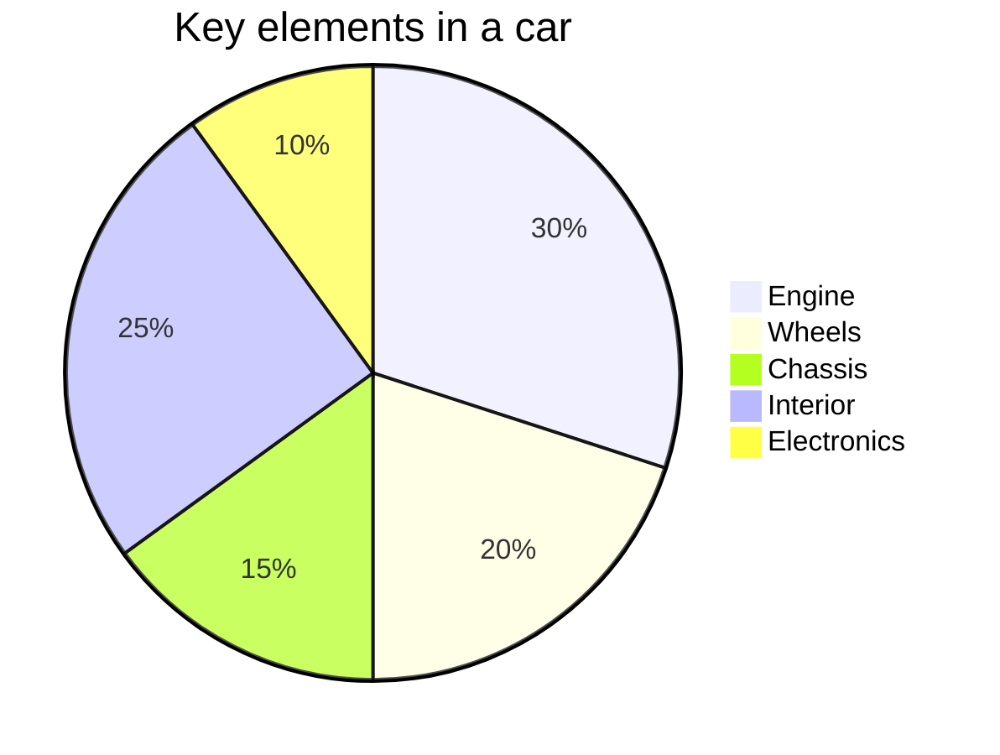
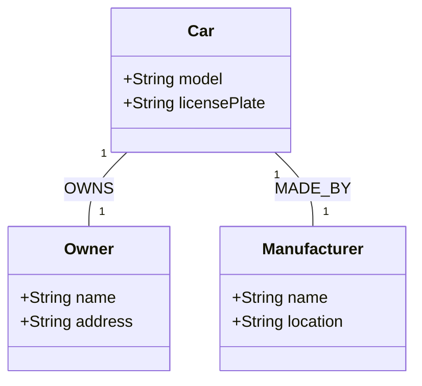

# Car Themed Mermaid Diagrams

## Flowchart


```mermaid
flowchart TD
    Start[Start] --> A{Is the car working?}
    A -->|Yes| B[Drive the car]
    A -->|No| C{Can you fix it?}
    C -->|Yes| D[Fix the car]
    C -->|No| E[Call a mechanic]
```


## Sequence Diagram


```mermaid
sequenceDiagram
    participant Driver as Driver
    participant Car as Car
    participant Mechanic as Mechanic
    Driver->>Car: Start engine
    Car-->>Driver: Engine fails
    Driver->>Mechanic: Request repair
    Mechanic->>Car: Repair engine
    Car-->>Mechanic: Engine fixed
    Mechanic->>Driver: Return car
```

## Class Diagram


```mermaid
classDiagram
    class Car {
        +startEngine()
        +stopEngine()
        -engineStatus
    }
    class Driver {
        +driveCar()
    }
    Driver "1" *-- "1" Car: drives
```

## State Diagram


```mermaid
stateDiagram
    [*] --> Parked
    Parked --> Running: Start Engine
    Running --> Parked: Stop Engine
    Running --> NeedsMaintenance: Engine Light On
    NeedsMaintenance --> Running: Fix Car
```

## Pie Chart


```mermaid
pie
    title Key elements in a car
    "Engine" : 30
    "Wheels" : 20
    "Chassis" : 15
    "Interior" : 25
    "Electronics" : 10
```

## Entity Relationship Diagram


```mermaid
classDiagram
    class Car {
        +String model
        +String licensePlate
    }
    class Owner {
        +String name
        +String address
    }
    class Manufacturer {
        +String name
        +String location
    }
    Car "1"--"1" Owner: OWNS
    Car "1" -- "1" Manufacturer: MADE_BY
```

## gitGraph

```mermaid
```

